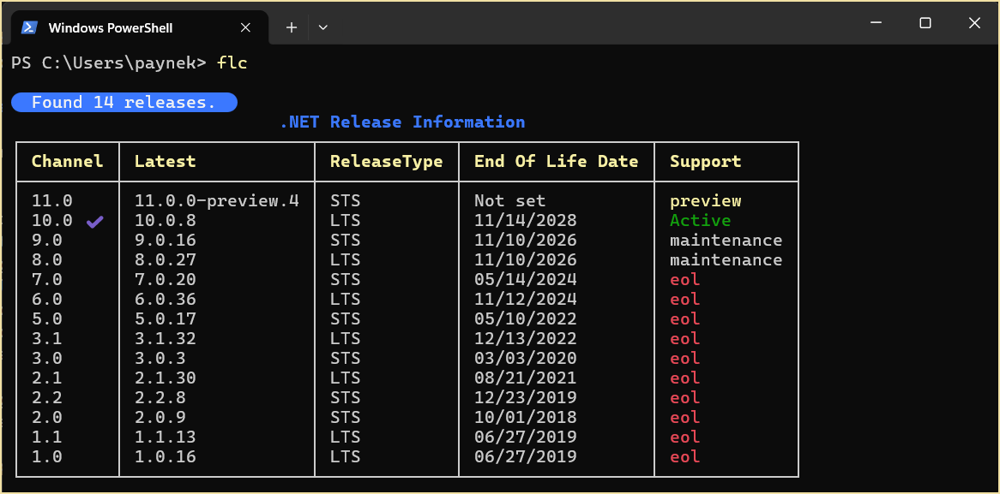

# About

A `dotnet tool` to show the life cycle for .NET Core frameworks. 

See [dotnet Framework life cycle tool](https://dev.to/karenpayneoregon/dotnet-framework-life-cycle-tool-103d) article




## Required

- System.CommandLine (NuGet package))
- CommonLibrary
- SpectreConsoleLibrary

## Installation

**NuGet.config**

```xml
<?xml version="1.0" encoding="utf-8"?>
<configuration>
    <packageSources>
        <clear />
        <add key="local-nupkg" value="./nupkg" />
        <add key="nuget.org" value="https://api.nuget.org/v3/index.json" />
    </packageSources>

    <packageSourceMapping>
        <packageSource key="local-nupkg">
            <package pattern="FrameworkLifeCycle" />
        </packageSource>

        <packageSource key="nuget.org">
            <package pattern="*" />
        </packageSource>
    </packageSourceMapping>
</configuration>
```

**install the tool**


```batch
dotnet tool install --global FrameworkLifeCycle --configfile .\NuGet.config
pause
```

**uninstall the tool**


```batch
dotnet tool uninstall -g FrameworkLifeCycle
pause
```
