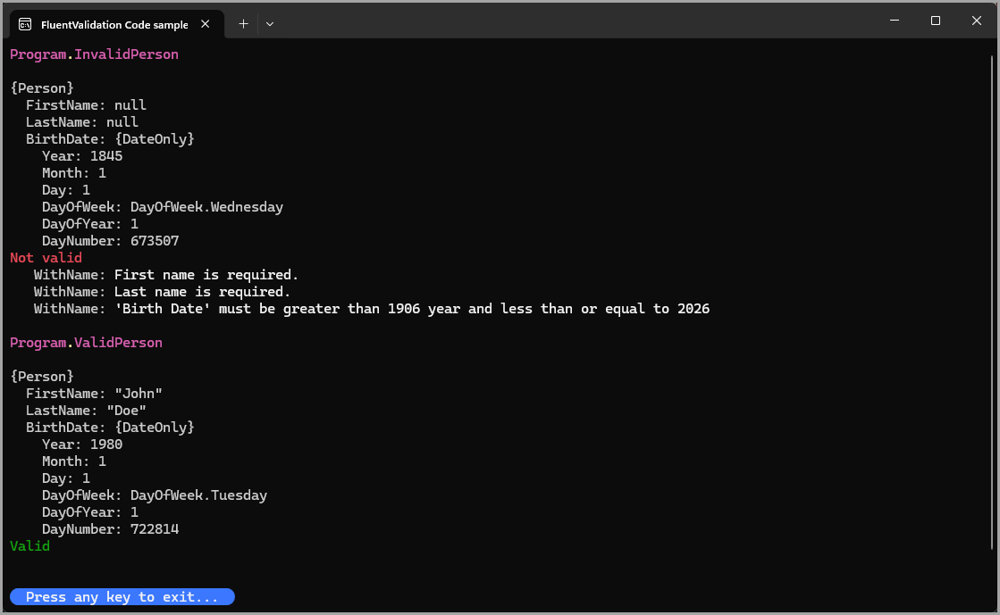

# FluentValidation sample

An example for `IRuleBuilder<T, DateOnly>`

- LanguageExtensions
  - Custom rule `BirthDateRule` using an extension method which implements `IRuleBuilderOptions`
- A shared validator for two properties FirstName and LastName
- Classes\Program.cs
  - A Global.DisplayNameResolver to split property names in error messages. Most examples on the web show `SplitPascalCase()` but fail to mention its an internal method now.
- Validators
  - FirstLastNameValidator
  - PersonValidator

